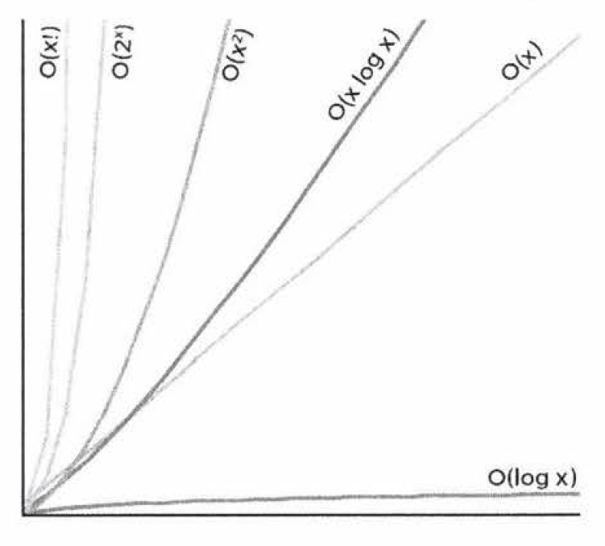

# Asymptotic Analisis 

TODO: 

- Read chapter in the beginning of one theory of computation book, so just go read it. 

- https://www.youtube.com/watch?v=V42FBiohc6c&list=PL2_aWCzGMAwI9HK8YPVBjElbLbI3ufctn

- CTCI chapter

## Big-O notation

**Algorithm runtime and space complexity analysis**

Big O is difficult concept at first. However, once it "clicks", it gets fairly easy. The same
patterns come up again and again, and the rest you can derive.

You need to know Big O, it's a MUST in order to understand the running complexity and
memory footprint of the algorithms that you design and implement.

### Logarithmic

**O(log N)**

log<sub>2</sub>N = k -> 2<sup>k</sup> = N

When you see a problem where the number of elements in the problem space gets halved each time, that will likely
be a O(log N) runtime.

This is the reason why finding an element in a balanced binary search tree is O(log N). With each comparison, we
go either left or right. Half the nodes are on each side, so we cut the problem space in half each time.

### Linear Runtime 

### Polinomial 

### Square

### Exponential

Recursive calls: O(branches<sup>depth</sup>)

If there are two branches per recursive call, and we go as deep as N, therefore the runtime is O(2<sup>N</sup>).

Generally speaking, when you see an algorithm with multiple recursive calls, you're looking at exponential runtime.

Memoization is a tecnique used to optimize exponential time recursive algorithms.

### Rate of increase for some of the common big O times

From best to worst:

- O(log x)
- O(x)
- O(x log x)
- O(x<sup>2</sup>)
- O(2<sup>x</sup>)
- O(x!)



### Important concepts

- **Drop the constants**

- **Drop the non-dominant terms**

- **Multi-part algorithms: add vs multiply**

Suppose you have an algorithm that has two steps. When do you multiply the runtimes
and when do you add them?

Add the runtimes: O(A + B)

```
for(int a: arrA) {
  print(a);
}

for(int b: arrB) {
  print(b);
}
```

In this example, we do A chunks of work then B chunks of work. Therefore, the total
amount of work is O(A + B).

Multiply the runtimes: O(A * B)

```
for(int a: arrA) {
  for(int b: arrB) {
    print(a + "," + b);
  }
}
```

In this example, we do B chunks of work for each element in A. Therefore, the total
amount of work is O(A * B).


**Sources:**

- [Big Oh Cheat Sheet](https://www.bigocheatsheet.com/)
- [mycodeschool](https://www.youtube.com/watch?v=V42FBiohc6c&list=PL2_aWCzGMAwI9HK8YPVBjElbLbI3ufctn)
- CTCI - chapter Vl
